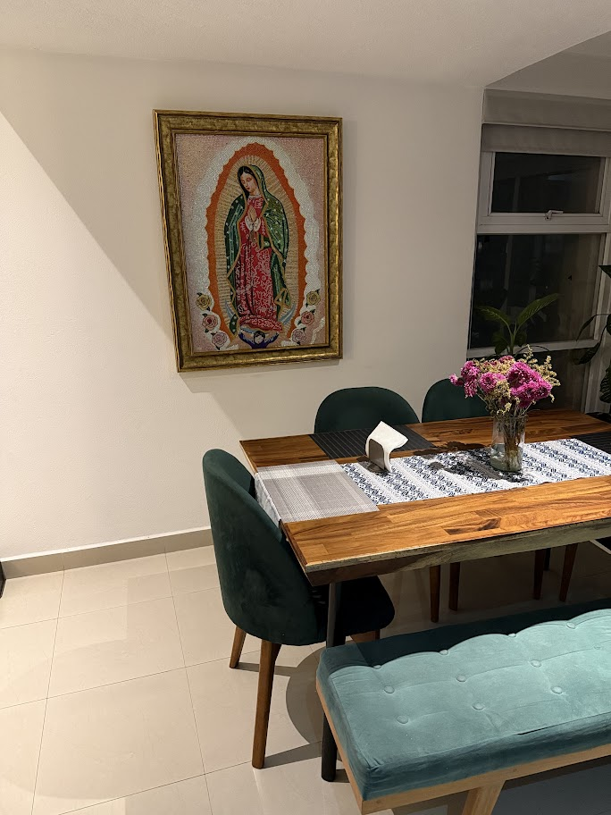
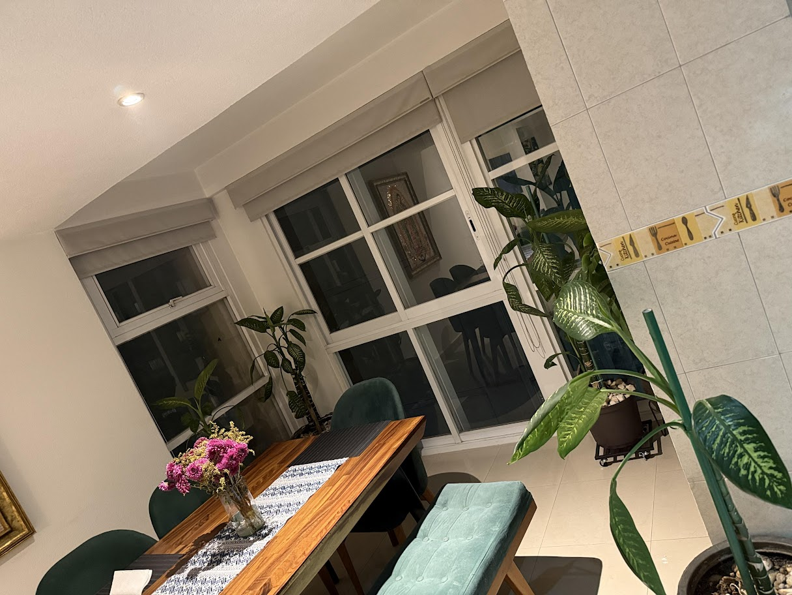
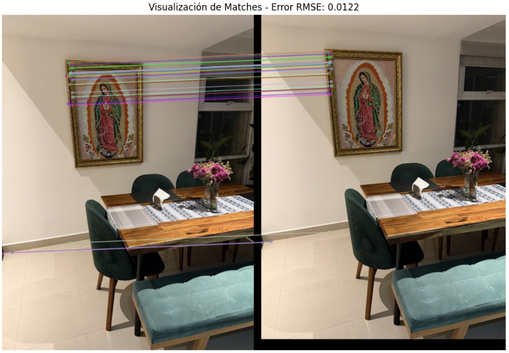
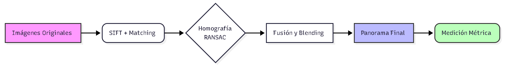
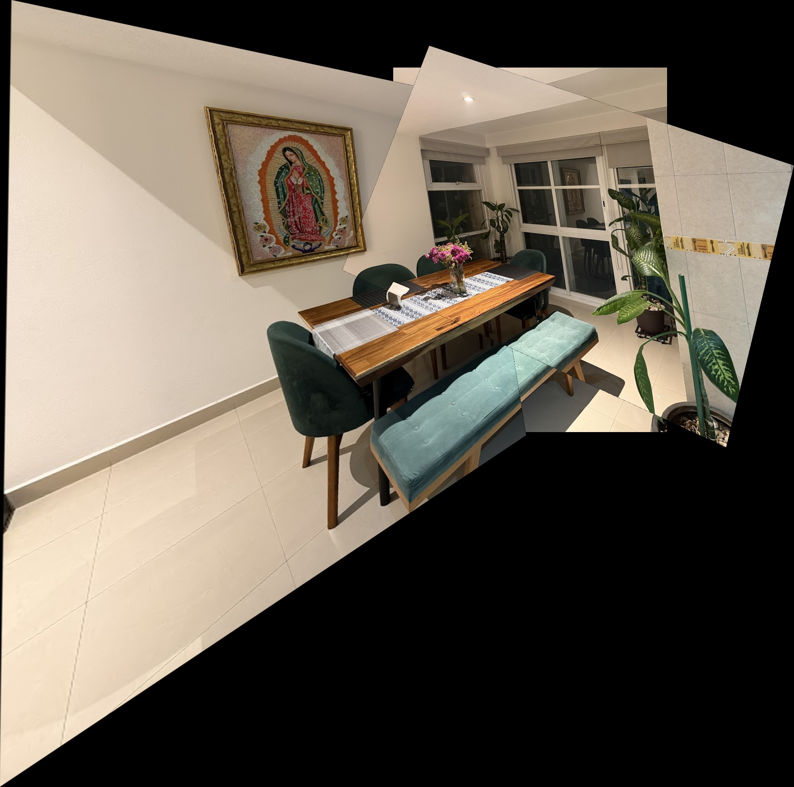
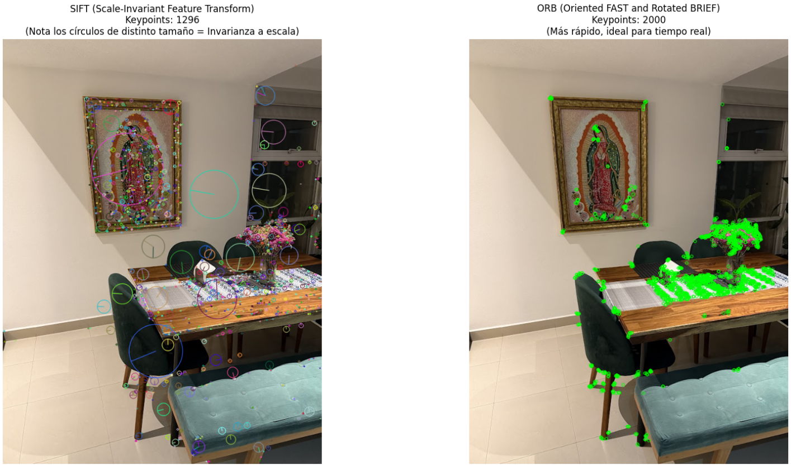

# Fusión de Perspectivas: Reconstrucción Panorámica y Medición Métrica

**Autores:** David Giraldo Valencia, Andrés Felipe Moreno Calle, Víctor Manuel Velásquez Cabeza y Juan Pablo Palacio Pérez  
**Curso:** Visión por Computador - Universidad Nacional de Colombia  
**Fecha:** Noviembre 2025  

---

## 1. Introducción

El registro de imágenes (*Image Registration*) es un problema fundamental en la visión por computador que busca alinear dos o más imágenes de la misma escena tomadas desde diferentes puntos de vista. Este proceso es la base de aplicaciones modernas como la creación de panoramas en teléfonos móviles, la fotogrametría aérea y la reconstrucción 3D.

El objetivo de este proyecto es doble:
1.  **Reconstrucción Visual:** Implementar un pipeline robusto para fusionar tres fotografías de un comedor en una única vista panorámica coherente.
2.  **Extracción de Información Métrica:** Calibrar el sistema utilizando objetos de referencia conocidos para realizar mediciones del mundo real sobre la imagen reconstruida, analizando los desafíos que impone la perspectiva.

---

## 2. Marco Teórico

Para lograr un registro preciso, integramos varios conceptos clave de la geometría de múltiples vistas:

### 2.1 Detección de Características (SIFT)
Utilizamos **SIFT (Scale-Invariant Feature Transform)**, que detecta extremos en el espacio de escala (Diferencia de Gaussianas) y describe cada punto con un vector invariante a la iluminación y el punto de vista.

### 2.2 Estimación de Homografía
Modelamos la transformación entre las imágenes como una **Homografía Planar** ($H$), una matriz de $3 \times 3$ con 8 grados de libertad que mapea puntos de un plano en una imagen a otro plano en la imagen destino:

$$
\begin{bmatrix} x' \\ y' \\ 1 \end{bmatrix} = H \begin{bmatrix} x \\ y \\ 1 \end{bmatrix}
$$

### 2.3 Robustez con RANSAC
Para evitar que los errores (outliers) distorsionen la imagen, utilizamos **RANSAC (Random Sample Consensus)**. Este algoritmo estima la homografía iterativamente utilizando subconjuntos aleatorios de puntos y selecciona el modelo que tenga el mayor número de *inliers* (puntos coherentes geométricamente).

---

## 3. Metodología

El proyecto se desarrolló en Python utilizando la librería OpenCV.

### 3.1 Pipeline de Registro
El sistema recibe como entrada tres fotografías tomadas desde diferentes ángulos. Estas imágenes presentan variaciones significativas de perspectiva que el algoritmo debe corregir.

  
  
  

*Figura 1: Imágenes originales de entrada (Izquierda, Centro y Derecha).*

El proceso de registro se ejecuta en cuatro etapas secuenciales:

1.  **Detección:** Extracción de características **SIFT** en las tres imágenes, identificando miles de puntos clave invariantes a la escala y rotación.
2.  **Matching Robusto:** Emparejamiento de descriptores mediante fuerza bruta (`BFMatcher`). Se aplicó el **Lowe's Ratio Test** (ratio = 0.75) para descartar coincidencias ambiguas y asegurar que solo se mantengan los puntos de alta confianza.

    
    *Figura 2: Visualización de correspondencias (inliers) entre la imagen central y una lateral tras aplicar el filtro de RANSAC.*

3.  **Fusión Secuencial (Stitching):** Se implementó una estrategia de crecimiento incremental para minimizar distorsiones:
    * **Paso 1:** Se definió la imagen central (`IMG02`) como plano de referencia (ancla) y se calculó la homografía $H_{Izq \to Centro}$ para registrar la imagen izquierda.
    * **Paso 2:** El panorama parcial resultante se utilizó como nueva base para fusionar la imagen derecha.
4.  **Composición:** Se recalculó dinámicamente el tamaño del lienzo ("canvas") aplicando traslaciones y **blending** basado en máscaras para suavizar las uniones.

### 3.2 Estrategia de Medición
Se implementó una herramienta interactiva para calibrar la escala ($px \to cm$). Inicialmente, se usó la altura del cuadro de la Virgen (117 cm) como referencia vertical. Posteriormente, se implementó una **re-calibración por planos** utilizando el ancho de la mesa para corregir el error de perspectiva en objetos horizontales.

### 3.3 Diagrama de Flujo
A continuación se resume el proceso completo implementado en el pipeline:

*Figura 3: Diagrama de flujo del proceso de registro, fusión y medición de imágenes.*

---

## 4. Experimentos y Resultados

### 4.1 Validación con Imágenes Sintéticas
Calculamos el **Error RMSE** (Root Mean Square Error) entre la matriz estimada por nuestro algoritmo y la matriz real (*Ground Truth*), cumpliendo con la Parte 1 del taller.

| Experimento | Tipo de Transformación | Error RMSE (px) | Estado |
|:-----------:|:----------------------:|:---------------:|:------:|
| 1           | Traslación Pura        | 0.0122          | ✅ Excelente |
| 2           | Rotación ($10^\circ$)  | 0.0212          | ✅ Excelente |
| 3           | Escala ($1.2x$)        | 0.0621          | ✅ Excelente |
| 4           | Mixto (Rot+Esc+Tras)   | 0.0829          | ✅ Excelente |

*Tabla 1: Resultados de la validación sintética. El error sub-píxel (< 0.1) confirma la alta precisión de SIFT+RANSAC.*

### 4.2 Resultado Visual (Panorama)
El algoritmo logró fusionar exitosamente las tres vistas.

*Figura 4: Panorama final fusionado a partir de las tres vistas originales.*

### 4.3 Mediciones del Mundo Real
Se realizaron mediciones sobre el panorama final.

| Objeto | Medida Real (GT) | Medida Estimada | Error Absoluto |
|:-------|:----------------:|:---------------:|:--------------:|
| Mesa (Ancho) | 161.1 cm | *161.10 cm* (Calib) | 0.00 cm |
| Silla (Respaldo) | N/A | 50.96 cm | N/A |
| Ventana (Ancho) | N/A | 77.37 cm | N/A |
| Planta/Maceta (Altura) | N/A | 21.72 cm | N/A |

*Tabla 2: Mediciones finales de objetos en la escena. La mesa se utilizó como objeto de calibración para el plano horizontal, garantizando la precisión para los demás objetos cercanos.*

---

## 5. Análisis y Discusión

### 5.1 Comparación de Detectores: SIFT vs. ORB
En la fase exploratoria, comparamos SIFT con ORB. SIFT generó descriptores más robustos ante los cambios de escala presentes en las fotos. Esto justifica la elección de SIFT a pesar de su mayor costo computacional.

*Figura 5: Comparación visual. SIFT (izq) detecta escala y orientación, mientras ORB (der) es más simple.*

### 5.2 El Desafío de la Perspectiva (Análisis de Error)
Uno de los hallazgos más críticos ocurrió durante la calibración. Inicialmente, al calibrar el sistema usando el cuadro en la pared (plano vertical) e intentar medir la mesa (plano horizontal), obtuvimos un **error sistemático del 50.28%**.

Esto se debe a que la homografía es una transformación planar. La relación de escala ($px/cm$) en la pared del fondo es muy diferente a la de la mesa, que está más cerca de la cámara y sufre de escorzo (*foreshortening*). La re-calibración por planos fue esencial para mitigar este error.

---

## 6. Conclusiones

1.  **Robustez del Pipeline:** La combinación de SIFT para detección y RANSAC para filtrado demostró ser altamente eficaz, logrando errores de reproyección sub-píxel.
2.  **Limitaciones de la Fotogrametría 2D:** Este proyecto evidenció que sin información de profundidad, las mediciones precisas requieren calibración específica para cada plano de profundidad.

---

## 7. Referencias

1.  Lowe, D. G. (2004). "Distinctive Image Features from Scale-Invariant Keypoints". *International Journal of Computer Vision*.
2.  Fischler, M. A., & Bolles, R. C. (1981). "Random sample consensus: a paradigm for model fitting...". *Communications of the ACM*.
3.  Szeliski, R. (2010). *Computer Vision: Algorithms and Applications*. Springer.
4.  Hartley, R., & Zisserman, A. (2003). *Multiple View Geometry in Computer Vision*. Cambridge University Press.
5.  OpenCV Documentation. "Feature Matching + Homography to find Objects".

---

## 8. Contribución Individual

* **Juan Pablo Palacio Pérez:** Desarrollo del núcleo del pipeline de registro (estimación de Homografía, RANSAC y Blending) y ejecución de la validación cruzada con imágenes sintéticas.
* **David Giraldo Valencia:** Implementación del módulo de medición métrica (`measurement.py`), desarrollo de la herramienta de calibración interactiva y estructura general de la documentación.
* **Andrés Felipe Moreno Calle:** Desarrollo del análisis exploratorio (Notebook 01), experimentación comparativa de detectores (SIFT vs. ORB) y generación del dataset de imágenes sintéticas para las pruebas de robustez.
* **Víctor Manuel Velásquez Cabeza:** Integración y estructuración del repositorio (gestión de dependencias y README), creación de las visualizaciones y diagramas de flujo del reporte, y análisis de resultados (discusión sobre el error de perspectiva).